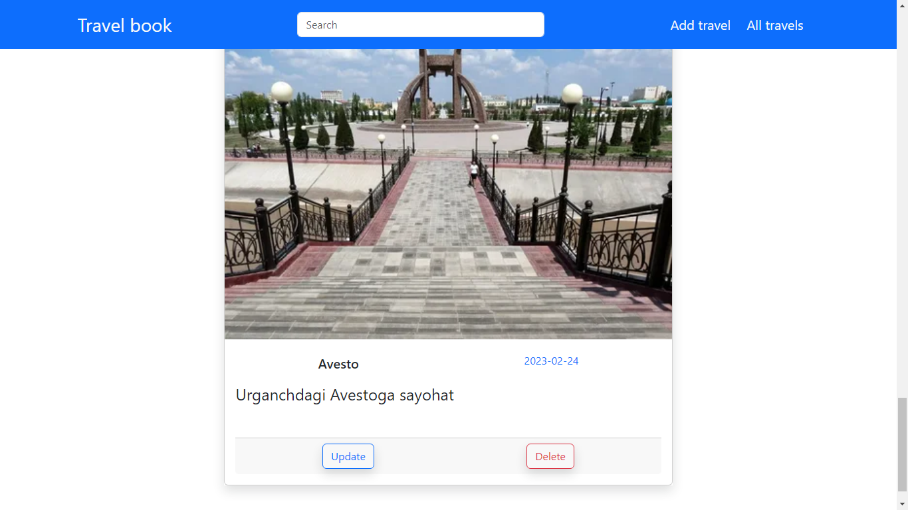
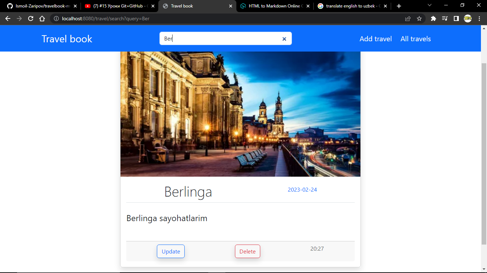
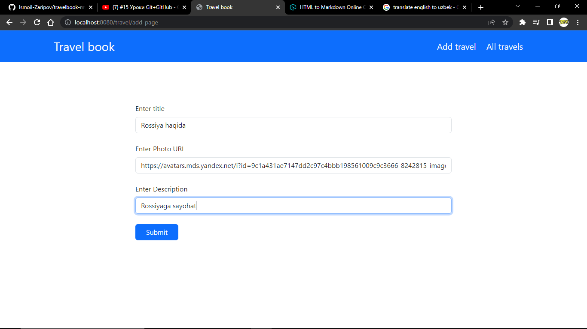
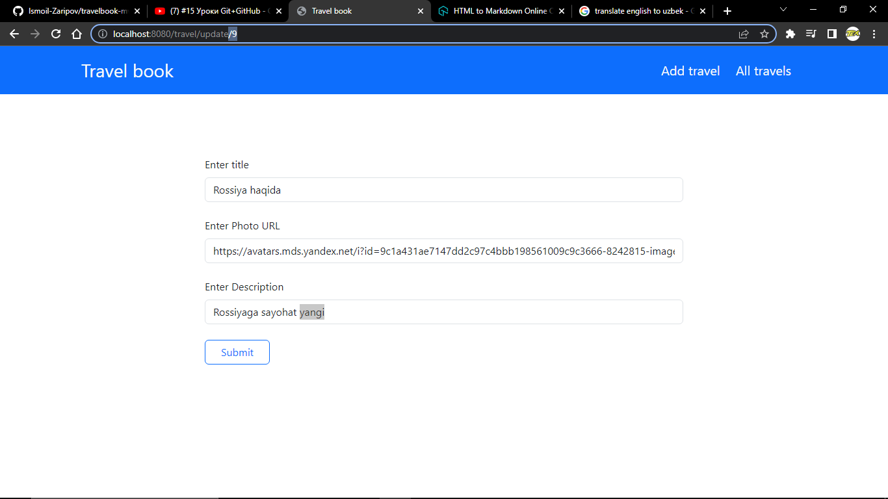
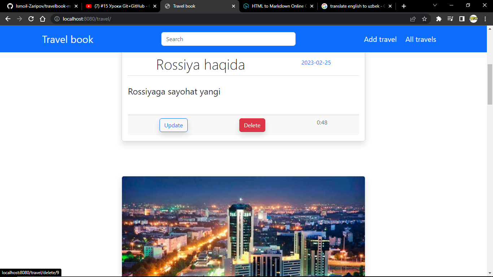

# Travel book Spring MVC app
***
## Home page
***

---
 ## List of top 5 photos by date
***

 Search travel
---
***

Create travel
---
***

Update
---
***

Delete
---
---
Application dependencies
---
---
      <dependencies>

        <dependency>
            <groupId>org.springframework.boot</groupId>
            <artifactId>spring-boot-starter-data-jpa</artifactId>
        </dependency>

        <dependency>
            <groupId>org.springframework.boot</groupId>
            <artifactId>spring-boot-starter-validation</artifactId>
        </dependency>

        <dependency>
            <groupId>org.springframework.boot</groupId>
            <artifactId>spring-boot-starter-thymeleaf</artifactId>
        </dependency>

        <dependency>
            <groupId>org.springframework.boot</groupId>
            <artifactId>spring-boot-starter-web</artifactId>
        </dependency>

        <dependency>
            <groupId>org.postgresql</groupId>
            <artifactId>postgresql</artifactId>
            <scope>runtime</scope>
        </dependency>

        <dependency>
            <groupId>org.projectlombok</groupId>
            <artifactId>lombok</artifactId>
            <optional>true</optional>
        </dependency>

        <dependency>
            <groupId>org.springframework.boot</groupId>
            <artifactId>spring-boot-starter-test</artifactId>
            <scope>test</scope>
        </dependency>

    </dependencies>
***
# Application properties
### database config
__spring.datasource.driver-class-name=org.postgresql.Driver__
__spring.datasource.username=postgres__
__spring.datasource.password=admin123__
__spring.datasource.url=jdbc:postgresql://localhost:5432/mvc_project__
__spring.jpa.hibernate.ddl-auto=update__
__spring.jpa.show-sql=true__
__spring.jpa.properties.hibernate.format_sql=true__
***
